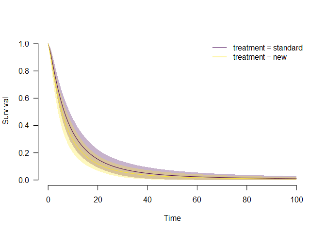

README
================

<!-- README.md is generated from README.Rmd. Please edit that file -->

# Robust Bayesian Survival Analysis (RoBSA)

This package estimates an ensemble of parametric survival models (with
different parametric families) and uses Bayesian model averaging to
combine them. The RoBSA ensemble uses Bayes factors to test for the
presence or absence of effects of the individual predictors and
evaluates the support for each parametric family. The resulting
model-averaged parameter estimates are based on posterior model
probabilities. The user can define a wide range of prior distributions
for the effect size, intercepts, and auxiliary parameters. The package
provides convenient functions for summary, visualizations, and fit
diagnostics.

See our pre-print Bartoš et al. (2021)
(<https://arxiv.org/abs/2112.08311>) introducing the methodology.

## Installation

The package requires [JAGS 4.3.0](https://mcmc-jags.sourceforge.io/) to
be installed. The development version of the package can be installed
from GitHub:

``` r
devtools::install_github("fbartos/RoBSA")
```

## Example

To illustrate the functionality of the package, we use the
`survival::veteran` data set, containing 137 survival times of patients
from a randomized trial of two treatment regimens for lung cancer. We
start by loading the packages and data set.

``` r
library("survival")
library("RoBSA")
#> Loading required namespace: runjags
#> module RoBSA loaded

head(veteran)
#>   trt celltype time status karno diagtime age prior
#> 1   1 squamous   72      1    60        7  69     0
#> 2   1 squamous  411      1    70        5  64    10
#> 3   1 squamous  228      1    60        3  38     0
#> 4   1 squamous  126      1    60        9  63    10
#> 5   1 squamous  118      1    70       11  65    10
#> 6   1 squamous   10      1    20        5  49     0
```

Before we fit the RoBSA ensemble with five accelerated failure times
parametric families (exponential, Weibull, log-normal, log-logistic, and
gamma), we must specify prior distributions for the intercepts and
auxiliary parameters (governing the scales and shapes) of the competing
parametric families. Here, we assume that we would expect the median
survival type in the standard treatment group to be 5 years with the
interquartile range of 10 years and the standard deviation of 0.5 for
the prior distributions (quantifying our uncertainty). To obtain those
priors, we use the `calibrate_quartiles()` function and print the list
object containing priors for the intercepts and auxiliary parameters.

``` r
priors <- calibrate_quartiles(median_t = 5, iq_range_t = 10, prior_sd = 0.5)
priors
#> $intercept
#> $intercept$`exp-aft`
#> Normal(1.98, 0.5)[-Inf, Inf]
#> $intercept$`weibull-aft`
#> Normal(2.06, 0.5)[-Inf, Inf]
#> $intercept$`lnorm-aft`
#> Normal(1.61, 0.5)[-Inf, Inf]
#> $intercept$`llogis-aft`
#> Normal(1.61, 0.5)[-Inf, Inf]
#> $intercept$`gamma-aft`
#> Normal(2.46, 0.5)[-Inf, Inf]
#> 
#> $aux
#> $aux$`weibull-aft`
#> LogNormal(-0.36, 0.57)[0, Inf]
#> $aux$`lnorm-aft`
#> LogNormal(0.2, 0.37)[0, Inf]
#> $aux$`llogis-aft`
#> LogNormal(0.15, 0.39)[0, Inf]
#> $aux$`gamma-aft`
#> LogNormal(-0.53, 0.63)[0, Inf]
```

We create new data.frame object containing a fit ready data set. We (1)
transform the survival times to years, (2) dummy code the treatment
variable, so 0 corresponds to the standard treatment and 1 to the test
treatment (i.e., the intercept of the model corresponds to the standard
treatment and the treatment estimate to the improvement in the test
treatment), and (3) scale the Karnofsky performance score (karno) to
range from 0-1 (i.e., the coefficient estimate corresponds to the
biggest possible difference).

``` r
df <- data.frame(
  time            = veteran$time / 12,
  status          = veteran$status,
  treatment_dummy = as.numeric(veteran$trt == 2),
  karno_scaled    = veteran$karno / 100 
)
head(df)
#>         time status treatment_dummy karno_scaled
#> 1  6.0000000      1               0          0.6
#> 2 34.2500000      1               0          0.7
#> 3 19.0000000      1               0          0.6
#> 4 10.5000000      1               0          0.6
#> 5  9.8333333      1               0          0.7
#> 6  0.8333333      1               0          0.2
```

### Hypothesis Testing

We proceed by specifying a RoBSA model intended to test an informed
hypothesis of the presence of the treatment effect centered around the
log(AF) of 0.3 with the sd of 0.1,5 via the informed prior distribution
Normal<sub>+</sub>(0.30,0.15) on the dummy coded treatment effect.
Furthermore, we adjust for the Karnofsky performance score by setting a
wider centered standard normal prior distribution Normal(0,1). To only
test for the presence of the treatment effect and include the covariate
in all models, we set `test_predictors = "treatment_dummy"`. Finally, we
pass the appropriate prior distributions to the `priors`,
`prior_intercept`, and `prior_aux` arguments.

``` r
fit.test <- RoBSA(
  Surv(time, status) ~ treatment_dummy + karno_scaled,
  data   = df,
  priors = list(
    treatment_dummy = prior("normal", parameters = list(0.30, 0.15), truncation = list(0, Inf)),
    karno_scaled    = prior("normal", parameters = list(0, 1))
  ),
  test_predictors = "treatment_dummy",
  prior_intercept = priors[["intercept"]],
  prior_aux       = priors[["aux"]]
) 
```

The `summary()` functions provides the main summary of the fitted model.

``` r
summary(fit.test)
#> Call:
#> RoBSA(formula = Surv(time, status) ~ treatment_dummy + karno_scaled, 
#>     data = df, priors = list(treatment_dummy = prior("normal", 
#>         parameters = list(0.3, 0.15), truncation = list(0, Inf)), 
#>         karno_scaled = prior("normal", parameters = list(0, 1))), 
#>     test_predictors = "treatment_dummy", prior_intercept = priors[["intercept"]], 
#>     prior_aux = priors[["aux"]])
#> 
#> Robust Bayesian Survival Analysis
#>             Models Prior prob. Post. prob. Incl. BF
#> exp-aft       2/10       0.200       0.322    1.900
#> weibull-aft   2/10       0.200       0.026    0.105
#> lnorm-aft     2/10       0.200       0.149    0.700
#> llogis-aft    2/10       0.200       0.499    3.979
#> gamma-aft     2/10       0.200       0.005    0.019
#> 
#> Model-averaged estimates
#>                  Mean Median 0.025 0.975 Prior prob. Post. prob. Incl. BF
#> treatment_dummy 0.019  0.000 0.000 0.226       0.500       0.129    0.147
#> karno_scaled    2.510  2.515 1.665 3.339       1.000       1.000       NA
#> 
#> Intercepts
#>              Mean Median  0.025 0.975
#> exp-aft     0.889  0.886  0.408 1.381
#> weibull-aft 0.952  0.950  0.453 1.462
#> lnorm-aft   0.239  0.237 -0.250 0.750
#> llogis-aft  0.210  0.202 -0.270 0.735
#> gamma-aft   1.140  1.133  0.580 1.738
```

In the first table, we see that most posterior model probability is
retained by the log-logistic (0.499), exponential (0.322), and
log-normal (0.149) family, with the inclusion Bayes factors quantifying
the change from prior to posterior model probabilities.

The second table then summarizes the model-averaged coefficient
estimates. Here, in the RoBSA ensemble intended for testing, we are
primary interested in the inclusion Bayes factor for the treatment
effect. We find Bayes factor 0.147, indicating that there is moderate
evidence in favor of no treatment effect (1/0.147 = 6.8) in comparison
to our informed hypothesis of a positive treatment effect.

### Parameter Estimation

Now we try to estimate the model-averaged estimate of the difference
between the two treatments. To do that, we change the prior distribution
from the informed positive treatment effect to a neutral standard normal
prior distribution allowing for both positive and negative treatment
effect. We further set `test_predictors` to `""` in order to omit models
assuming zero treatment effect.

``` r
fit.est <- RoBSA(
  Surv(time, status) ~ treatment_dummy + karno_scaled,
  data   = df,
  priors = list(
    treatment_dummy = prior("normal", parameters = list(0, 1)),
    karno_scaled    = prior("normal", parameters = list(0, 1))
  ),
  test_predictors = "",
  prior_intercept = priors[["intercept"]],
  prior_aux       = priors[["aux"]]
) 
```

``` r
summary(fit.est)
#> Call:
#> RoBSA(formula = Surv(time, status) ~ treatment_dummy + karno_scaled, 
#>     data = df, priors = list(treatment_dummy = prior("normal", 
#>         parameters = list(0, 1)), karno_scaled = prior("normal", 
#>         parameters = list(0, 1))), test_predictors = "", prior_intercept = priors[["intercept"]], 
#>     prior_aux = priors[["aux"]])
#> 
#> Robust Bayesian Survival Analysis
#>             Models Prior prob. Post. prob. Incl. BF
#> exp-aft        1/5       0.200       0.254    1.364
#> weibull-aft    1/5       0.200       0.021    0.086
#> lnorm-aft      1/5       0.200       0.206    1.036
#> llogis-aft     1/5       0.200       0.515    4.244
#> gamma-aft      1/5       0.200       0.004    0.016
#> 
#> Model-averaged estimates
#>                   Mean Median  0.025 0.975 Prior prob. Post. prob. Incl. BF
#> treatment_dummy -0.183 -0.182 -0.559 0.183       1.000       1.000       NA
#> karno_scaled     2.535  2.536  1.738 3.308       1.000       1.000       NA
#> 
#> Intercepts
#>              Mean Median  0.025 0.975
#> exp-aft     0.930  0.934  0.444 1.412
#> weibull-aft 1.004  1.005  0.484 1.512
#> lnorm-aft   0.356  0.357 -0.172 0.876
#> llogis-aft  0.321  0.325 -0.184 0.843
#> gamma-aft   1.191  1.192  0.623 1.787
```

We again use the `summary()` function to obtain information about the
fitted model. We find out that the experimental treatment actually led
to notably shorter survival times with the mean model-averaged log(AF) =
-0.18, 95% CI\[-0.56, -0.18\]. Furthermore, we observe an enormous
effect of the scaled Karnofsky performance score, showing that moving
from 0 to 1 increases the survival times with the mean model-averaged
log(AF) = 2.54, 95% CI \[1.74, 3.31\].

### MCMC Diagnostics

To assess the convergence of the MCMC model, we can use the
`diagnostics = TRUE` argument in the `summary()` function. The resulting
table shows the maximum MCMC error, min effective sample size and
maximum R-hat for each of the models.

``` r
summary(fit.est, diagnostics = TRUE)
#> Call:
#> RoBSA(formula = Surv(time, status) ~ treatment_dummy + karno_scaled, 
#>     data = df, priors = list(treatment_dummy = prior("normal", 
#>         parameters = list(0, 1)), karno_scaled = prior("normal", 
#>         parameters = list(0, 1))), test_predictors = "", prior_intercept = priors[["intercept"]], 
#>     prior_aux = priors[["aux"]])
#> 
#> Robust Bayesian Survival Analysis
#>   Distribution   Prior treatment_dummy      Prior karno_scaled
#> 1      exp-aft Normal(0, 1)[-Inf, Inf] Normal(0, 1)[-Inf, Inf]
#> 2  weibull-aft Normal(0, 1)[-Inf, Inf] Normal(0, 1)[-Inf, Inf]
#> 3    lnorm-aft Normal(0, 1)[-Inf, Inf] Normal(0, 1)[-Inf, Inf]
#> 4   llogis-aft Normal(0, 1)[-Inf, Inf] Normal(0, 1)[-Inf, Inf]
#> 5    gamma-aft Normal(0, 1)[-Inf, Inf] Normal(0, 1)[-Inf, Inf]
#>                Prior intercept                      Prior aux Prior prob.
#> 1 Normal(1.98, 0.5)[-Inf, Inf]                                      0.200
#> 2 Normal(2.06, 0.5)[-Inf, Inf] LogNormal(-0.36, 0.57)[0, Inf]       0.200
#> 3 Normal(1.61, 0.5)[-Inf, Inf]   LogNormal(0.2, 0.37)[0, Inf]       0.200
#> 4 Normal(1.61, 0.5)[-Inf, Inf]  LogNormal(0.15, 0.39)[0, Inf]       0.200
#> 5 Normal(2.46, 0.5)[-Inf, Inf] LogNormal(-0.53, 0.63)[0, Inf]       0.200
#>   Post. prob. log(MargLik) Incl. BF
#> 1       0.254     -420.169    1.364
#> 2       0.021     -422.660    0.086
#> 3       0.206     -420.381    1.036
#> 4       0.515     -419.464    4.244
#> 5       0.004     -424.306    0.016
#> 
#> Models diagnostics overview
#>   Distribution   Prior treatment_dummy      Prior karno_scaled
#> 1      exp-aft Normal(0, 1)[-Inf, Inf] Normal(0, 1)[-Inf, Inf]
#> 2  weibull-aft Normal(0, 1)[-Inf, Inf] Normal(0, 1)[-Inf, Inf]
#> 3    lnorm-aft Normal(0, 1)[-Inf, Inf] Normal(0, 1)[-Inf, Inf]
#> 4   llogis-aft Normal(0, 1)[-Inf, Inf] Normal(0, 1)[-Inf, Inf]
#> 5    gamma-aft Normal(0, 1)[-Inf, Inf] Normal(0, 1)[-Inf, Inf]
#>                Prior intercept                      Prior aux max(MCMC error)
#> 1 Normal(1.98, 0.5)[-Inf, Inf]                                          0.018
#> 2 Normal(2.06, 0.5)[-Inf, Inf] LogNormal(-0.36, 0.57)[0, Inf]           0.020
#> 3 Normal(1.61, 0.5)[-Inf, Inf]   LogNormal(0.2, 0.37)[0, Inf]           0.019
#> 4 Normal(1.61, 0.5)[-Inf, Inf]  LogNormal(0.15, 0.39)[0, Inf]           0.017
#> 5 Normal(2.46, 0.5)[-Inf, Inf] LogNormal(-0.53, 0.63)[0, Inf]           0.021
#>   min(ESS) max(Rhat)
#> 1  455.000     1.003
#> 2  458.000     1.018
#> 3  487.000     1.002
#> 4  457.000     1.003
#> 5  379.000     1.003
```

We find that while the R-hat and max MCMC error is satisfactory for all
models from the RoBSA estimation ensemble, we might wish for a larger
ESS. To achieve that, we would simply increase the number of sampling
MCMC iterations by using the `iter` argument in the `RoBSA()` function.

### Visualizing Predicted Survival

To visualize the predicted model-averaged survival for each group, we
first need to create data.frame specifying the values for which we want
to predict the survival. Here, we create a monthly based prediction for
the first 20 years for the standard treatment (`df_standard`) and the
experimental treatment (`df_experimental`) for the median level of the
Karnofsky performance score.

``` r
df_standard <- data.frame(
  time            = seq(0, 20*12, 1) / 12,
  treatment_dummy = 0,
  karno_scaled    = median(df$karno_scaled)
)

df_experimental <- data.frame(
  time            = seq(0, 20*12, 1) / 12,
  treatment_dummy = 1,
  karno_scaled    = median(df$karno_scaled)
)
```

Then we predict the model-averaged survival with the `predict()`
function for each group.

``` r
predicted_standard     <- predict(fit.est, newdata = df_standard,     type = "survival")
predicted_experimental <- predict(fit.est, newdata = df_experimental, type = "survival")
```

Now, we can plot the predicted model-averaged survivals and 95% CI for
both groups.

``` r
plot(NA, type = "n", xlim = c(0, 20), ylim = c(0, 1), xlab = "Time (Years)", ylab = "Survival", las = 1, bty = "n")
# standard treatment group
lines(seq(0, 20*12, 1) / 12, predicted_standard$mean, col = "blue", lwd = 2)
polygon(
  x   = c(seq(0, 20*12, 1) / 12, rev(seq(0, 20*12, 1) / 12)),
  y   = c(predicted_standard$lCI, rev(predicted_standard$uCI)),
  col = "#0000FF33"
)

# experimental treatment group
lines(seq(0, 20*12, 1) / 12, predicted_experimental$mean, col = "red", lwd = 2)
polygon(
  x   = c(seq(0, 20*12, 1) / 12, rev(seq(0, 20*12, 1) / 12)),
  y   = c(predicted_experimental$lCI, rev(predicted_experimental$uCI)),
  col = "#FF000033"
)
```



### References

<div id="refs" class="references csl-bib-body hanging-indent"
line-spacing="2">

<div id="ref-bartos2021informed" class="csl-entry">

Bartoš, F., Aust, F., & Haaf, J. M. (2021). *Informed Bayesian survival
analysis*. arXiv. <https://arxiv.org/abs/2112.08311>

</div>

</div>
